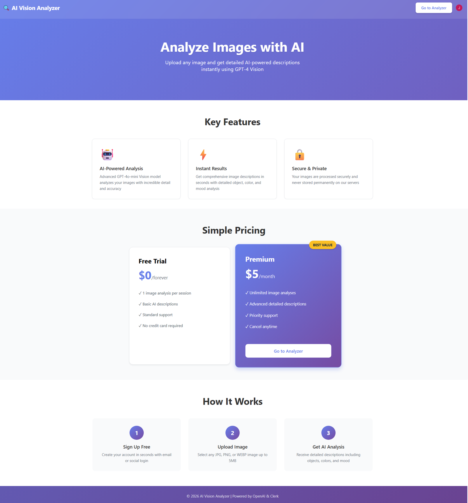
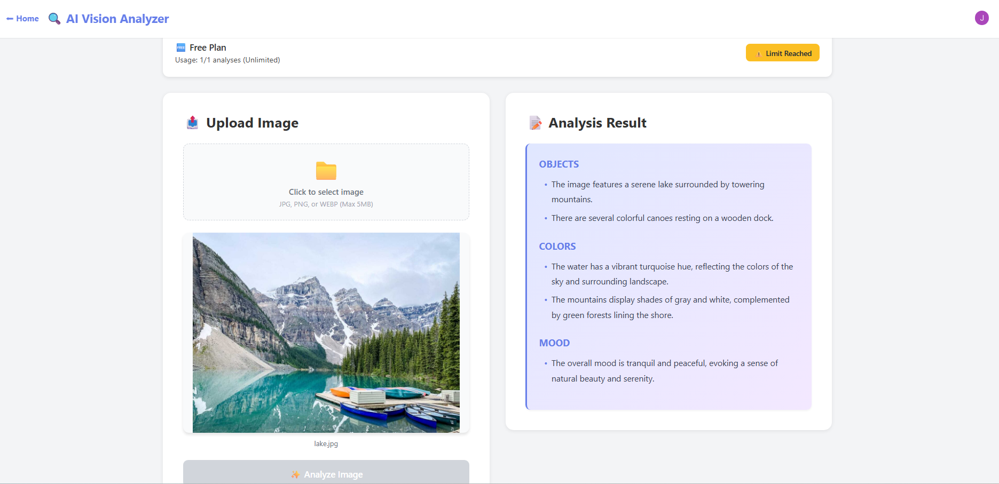
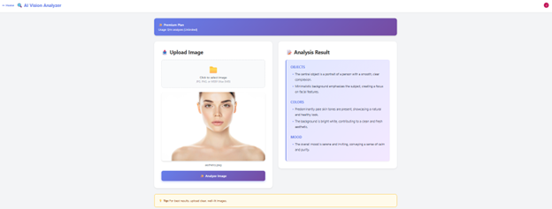

# AI Vision Analyzer

AI-powered image analysis service using OpenAI GPT-4 Vision API with tiered access control.

[](https://ai-vision-service-tau.vercel.app)

---

## 1. Project Overview

### Description

AI Vision Analyzer is a production-ready SaaS application that provides intelligent image analysis through OpenAI's GPT-4 Vision API. Users upload images to receive structured descriptions covering object detection, color analysis, and mood assessment. The platform implements a freemium business model with usage-based access control.

### Technology Stack

| Layer | Technology |
|-------|-----------|
| Frontend | Next.js 14, TypeScript, React 18 |
| Backend | FastAPI, Python 3.9+ |
| AI/ML | OpenAI Vision API (gpt-4o-mini) |
| Authentication | Clerk |
| Deployment | Vercel (Serverless) |
| Version Control | Git, GitHub |

---

## 2. Features

### Core Functionality
- AI-powered image analysis with structured output (Objects, Colors, Mood)
- Multi-provider authentication (Email, Google, GitHub)
- Tiered access control (Free: 1 analysis/session, Premium: unlimited)
- Real-time usage tracking and quota management
- Image validation (type, size) with preview
- Professional responsive UI with gradient design
- Comprehensive error handling and user feedback

### Additional Capabilities
- Enhanced landing page with conversion optimization
- Session-based usage analytics
- Debug logging for troubleshooting
- Secure image processing (no permanent storage)
- Mobile-responsive interface

---

## 3. Setup Instructions

### Prerequisites

**Required Software:**
- Node.js ≥18.0.0
- Python ≥3.9.0
- npm or yarn
- Git

**Required Accounts:**
- [OpenAI Platform](https://platform.openai.com) - API access
- [Clerk](https://clerk.com) - Authentication services  
- [Vercel](https://vercel.com) - Deployment platform

### Installation

Clone and install dependencies:

```bash
# Clone repository
git clone https://github.com/jjayytm/ai-vision-service.git
cd ai-vision-service

# Install frontend dependencies
npm install

# Install backend dependencies
pip install -r requirements.txt --break-system-packages
```

### Environment Configuration

Create `.env.local` in project root:

```bash
# Clerk Authentication
NEXT_PUBLIC_CLERK_PUBLISHABLE_KEY=pk_test_xxxxxxxxxxxxx
CLERK_SECRET_KEY=sk_test_xxxxxxxxxxxxx
CLERK_JWKS_URL=https://your-app.clerk.accounts.dev/.well-known/jwks.json

# OpenAI API
OPENAI_API_KEY=sk-proj-xxxxxxxxxxxxx
```

**Obtaining Credentials:**

*Clerk Configuration:*
1. Create application at [clerk.com](https://clerk.com)
2. Navigate to Dashboard → API Keys
3. Copy Publishable Key and Secret Key
4. Locate JWKS URL in Advanced settings
5. Enable authentication providers (Email, Google, GitHub)

*OpenAI Configuration:*
1. Access [platform.openai.com/api-keys](https://platform.openai.com/api-keys)
2. Generate new secret key
3. Copy key (format: `sk-proj-...`)

### Local Development

Start development server:

```bash
npm run dev
```

Application runs at `http://localhost:3000`

**Backend Note:** FastAPI runs as Vercel serverless function. For local API testing:
- Deploy preview: `vercel`
- Or run separately: `uvicorn api.index:app --reload --port 8000`

---

## 4. API Documentation

### Endpoint Overview

| Endpoint | Method | Auth Required | Description |
|----------|--------|---------------|-------------|
| `/api/health` | GET | No | Service health check |
| `/api/analyze` | POST | Yes | Analyze uploaded image |
| `/api/usage` | GET | Yes | Retrieve usage statistics |

**Base URL:** `https://ai-vision-service-tau.vercel.app/api`

### Health Check

```http
GET /api/health
```

**Response:**
```json
{
  "status": "healthy",
  "service": "AI Vision Service",
  "version": "1.0.0"
}
```

### Analyze Image

```http
POST /api/analyze
Authorization: Bearer {jwt_token}
Content-Type: multipart/form-data
```

**Parameters:**
- `file` (required): Image file
  - Formats: JPG, JPEG, PNG, WEBP
  - Max size: 5MB

**Success Response (200):**
```json
{
  "success": true,
  "description": "### Objects\n- Object descriptions...\n### Colors\n- Color analysis...\n### Mood\n- Mood assessment...",
  "user_id": "user_xxxxx",
  "tier": "premium"
}
```

**Error Responses:**
- `400` Invalid file type
- `413` File size exceeds limit
- `429` Usage quota exceeded
- `500` Internal server error

### Check Usage

```http
GET /api/usage
Authorization: Bearer {jwt_token}
```

**Response:**
```json
{
  "user_id": "user_xxxxx",
  "tier": "free",
  "analyses_used": 1,
  "limit": 1
}
```

Note: Premium users receive `"limit": "unlimited"`

### Authentication

Protected endpoints require JWT authentication via Clerk. Include token in request header:

```
Authorization: Bearer {clerk_jwt_token}
```

Token validation occurs server-side using Clerk JWKS endpoint. User identity and tier information are extracted from validated token claims.

---

## 5. Deployment

### Vercel Deployment

**Initial Setup:**
```bash
# Install CLI
npm install -g vercel

# Authenticate
vercel login

# Deploy to production
vercel --prod
```

**Environment Variables:**

Configure via Vercel Dashboard (Settings → Environment Variables) or CLI:

```bash
vercel env add NEXT_PUBLIC_CLERK_PUBLISHABLE_KEY
vercel env add CLERK_SECRET_KEY
vercel env add CLERK_JWKS_URL
vercel env add OPENAI_API_KEY
```

Select environments: Production, Preview, Development

**Continuous Deployment:**

Automatic deployment on push to `main` branch when GitHub integration is enabled.

---

## 6. Live Demo

**Production URL:** [https://ai-vision-service-tau.vercel.app](https://ai-vision-service-tau.vercel.app)

### Access Information

**Account Creation:**
Users self-register via:
- Email and password
- Google OAuth
- GitHub OAuth

**Tier Assignment:**
- Free Tier: Default for new users (1 analysis per session)
- Premium Tier: Configured via Clerk Dashboard
  - Navigate to Users → Select User → Public Metadata
  - Add: `{"tier": "premium"}`
  - User must sign out and sign in for changes to take effect

---

## 7. Screenshots

### Landing Page


*Professional landing page featuring hero section, feature showcase, pricing comparison, and conversion-optimized CTAs*

### Analysis Interface - Free Tier


*Free tier interface displaying usage limits (1/1), upload functionality, AI-generated analysis with structured output, and upgrade prompts*

### Analysis Interface - Premium Tier


*Premium interface showing unlimited usage quota (X/∞), multiple analysis capability, and identical output structure*

---

## 8. Known Limitations

### In-Memory Usage Tracking
**Issue:** Usage counters stored in application memory, reset on serverless function cold starts.

**Impact:** Usage statistics lost on deployment or function timeout.

**Mitigation:** Production implementation requires persistent storage (PostgreSQL, Redis, DynamoDB).

### Session-Based Quotas
**Issue:** Free tier limit enforced per session rather than per user account.

**Impact:** Quota resets may occur during function restarts.

**Mitigation:** Implement database-backed quota system with configurable time windows (daily, monthly).

### Manual Tier Management
**Issue:** Premium tier assignment requires manual Clerk Dashboard configuration.

**Impact:** No automated subscription workflow or payment processing.

**Mitigation:** Integrate payment gateway (Stripe) with webhook-based tier provisioning.

### Ephemeral Image Processing
**Issue:** Images discarded after analysis, no retention or history.

**Impact:** Users cannot review previous analyses.

**Mitigation:** Add cloud storage (AWS S3, Cloudinary) with database tracking for analysis history.

---

## Project Structure

```
ai-vision-service/
├── api/
│   └── index.py              # FastAPI backend
├── pages/
│   ├── _app.tsx              # Clerk provider
│   ├── index.tsx             # Landing page
│   └── analyze.tsx           # Analysis interface
├── public/
│   ├── landing-page.png
│   ├── analysis-result-free.png
│   └── analysis-result-premium.png
├── styles/
│   └── globals.css
├── requirements.txt
├── package.json
├── vercel.json
└── tsconfig.json
```

---

## Contact

**Developer:** Juthamard Jirapanyalerd  
**Email:** jjaytnn@gmail.com  
**GitHub:** [github.com/jjayytm](https://github.com/jjayytm)  
**LinkedIn:** [linkedin.com/in/jjaytm](https://www.linkedin.com/in/jjaytm/)
